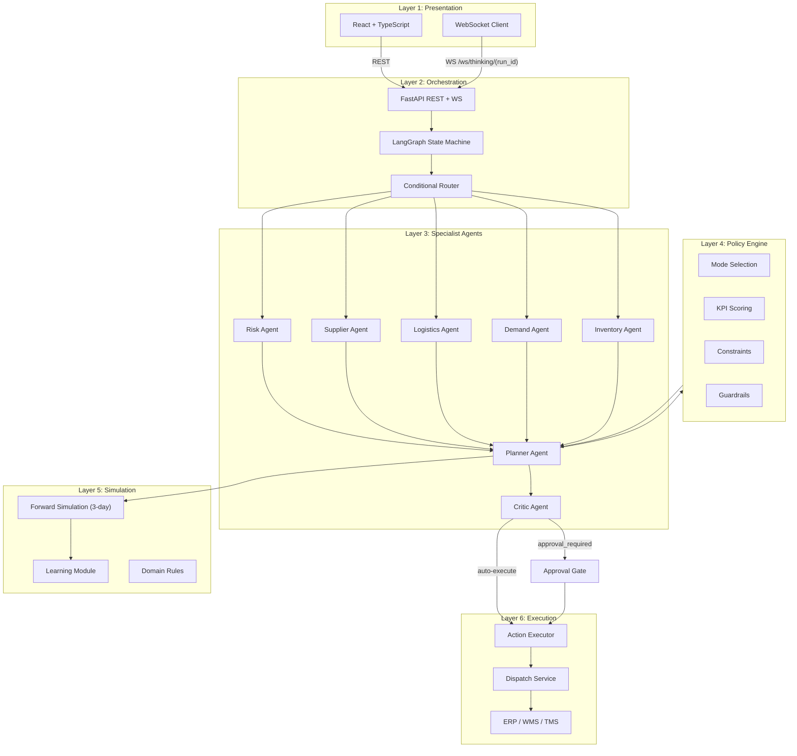
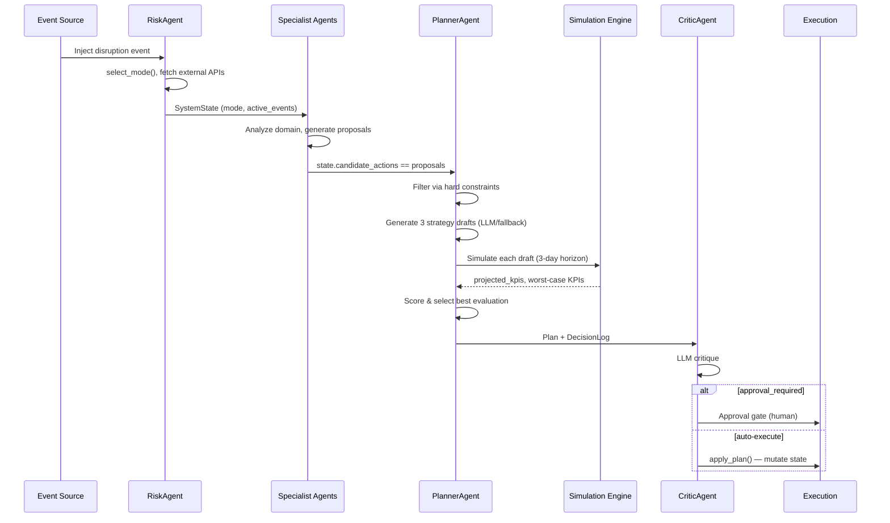
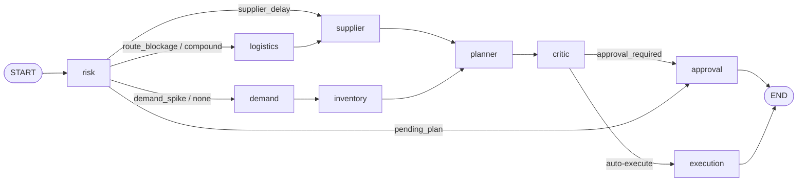

<div align="center">

# ChainCopilot — Agent Backend

**An MVP prototype exploring multi-agent supply chain intelligence with LangGraph and Google Gemini.**

ChainCopilot orchestrates a graph of specialized AI agents that detect disruptions, generate ranked recovery plans, and route decisions through a configurable human-in-the-loop approval gate. The project is a proof-of-concept built to explore autonomous planning, explainability, and learning loops in a supply chain context — not a production system.

---

[](https://python.org)
[](https://fastapi.tiangolo.com)
[](https://langchain-ai.github.io/langgraph/)
[](https://ai.google.dev)
[](https://docs.pydantic.dev)
[](https://sqlite.org)
[](https://developer.mozilla.org/en-US/docs/Web/API/WebSocket)
[](LICENSE)

---

### Tech Stack


</div>

---

## Overview

> **This is an MVP / research prototype.** It is not production-ready. Data is seeded from static CSV files, the database is a local SQLite file, execution actions are stubbed out, and there is no authentication. The goal is to demonstrate the architecture and reasoning capabilities of a multi-agent planning system.

When a disruption event is detected — a supplier delay, a route blockage, a demand spike, or a compound of all three — the system activates a graph of specialized AI agents that collaborate to produce a ranked, simulation-validated action plan. Every decision is explainable and gated behind a configurable approval policy.

The backend exposes a **FastAPI** REST + WebSocket API consumed by the React frontend (see [Related](#related)). Agents stream their reasoning in real time over WebSocket so you can watch the "thinking" process as it unfolds.

## Related

- **Frontend (Control Tower UI):** [github.com/dinhdat07/chain-copilot — supply-chain-management/scm-demo](https://github.com/dinhdat07/supply-chain-management) — React + TypeScript dashboard for this backend.

---

## Features

| Category | Capability |
| :--- | :--- |
| **Multi-agent orchestration** | LangGraph stateful graph with dynamic conditional routing across Risk, Supplier, Logistics, Demand, Inventory, Planner, and Critic agents |
| **Dual operating modes** | `NORMAL` planning vs. `CRISIS` recovery, with mode-aware scoring weights that shift priority from cost to recovery speed |
| **Strategy selection** | Three candidate strategies (`resilience_first`, `balanced`, `cost_first`) scored via a configurable KPI engine and selected by the Planner |
| **Forward simulation** | 3-day horizon simulation (T+1, T+2, T+3) projecting service level, disruption risk, recovery speed, at-risk SKUs, out-of-stock count, and backlog units |
| **Human-in-the-loop** | Policy guardrails trigger mandatory approval gates; operators can approve, reject, request a safer plan, or promote an alternative strategy |
| **Explainability** | Every decision log captures winning factors, rejection reasons, critic findings, constraint violations, and projected KPIs |
| **Learning loop** | After each resolved run, supplier reliability and route risk priors are updated and reflection notes are generated (LLM or deterministic fallback) |
| **Real-time streaming** | WebSocket event bus streams per-agent `ThinkingEvent` objects as the graph executes |
| **Persistent audit trail** | All envelopes, run records, traces, state snapshots, execution records, and decision logs are stored in SQLite |
| **Scenario simulation** | Four built-in disruption scenarios (`supplier_delay`, `demand_spike`, `route_blockage`, `compound_disruption`) for evaluation and demo |

---

## System Architecture

### Layer Diagram



### Agent Execution Flow



### LangGraph Routing



---

## Folder Structure

```
chain-copilot/
├── agents/                  # Specialist agent implementations
│   ├── risk.py              # RiskAgent — mode selection, external API calls
│   ├── supplier.py          # SupplierAgent — alternative sourcing evaluation
│   ├── logistics.py         # LogisticsAgent — reroute analysis
│   ├── demand.py            # DemandAgent — spike detection, rebalance proposals
│   ├── inventory.py         # InventoryAgent — ROP/safety stock analysis
│   ├── planner.py           # PlannerAgent — strategy drafting, KPI scoring
│   └── critic.py            # CriticAgent — LLM critique, approval gate
│
├── orchestrator/
│   ├── graph.py             # LangGraph graph construction
│   ├── router.py            # Conditional routing logic
│   ├── service.py           # ControlTower orchestration service
│   └── prompts.py           # LLM prompt templates
│
├── policies/
│   ├── modes.py             # NORMAL / CRISIS mode definitions & weights
│   ├── scoring.py           # KPI scoring engine
│   ├── constraints.py       # Hard / soft constraint enforcement
│   ├── guardrails.py        # Approval threshold guardrails
│   └── explainability.py   # Decision log population
│
├── simulation/
│   ├── runner.py            # ScenarioRunner — end-to-end scenario execution
│   ├── scenarios.py         # Built-in disruption scenario definitions
│   ├── evaluator.py         # Forward simulation (T+1/T+2/T+3)
│   ├── learning.py          # Learning loop — prior updates & reflection notes
│   └── domain_rules.py     # Supply chain domain constraint rules
│
├── execution/
│   ├── dispatch_service.py  # Action dispatch orchestration
│   ├── state_machine.py     # Execution state machine
│   └── adapters/            # ERP / WMS / TMS adapter stubs
│
├── actions/                 # Atomic action implementations
│   ├── executor.py
│   ├── reorder.py
│   ├── rebalance.py
│   ├── reroute.py
│   └── switch_supplier.py
│
├── core/
│   ├── models.py            # Pydantic domain models (SystemState, DecisionLog, …)
│   ├── state.py             # State initialization & cloning
│   ├── memory.py            # SQLiteStore — persistent artifact storage
│   ├── enums.py             # EventType, ApprovalStatus, OperatingMode
│   └── runtime_tracking.py # Run ID / trace ID generation & record building
│
├── streaming/
│   ├── event_bus.py         # Async pub/sub event bus for WebSocket streaming
│   └── schemas.py           # ThinkingEvent schema
│
├── llm/
│   ├── service.py           # LLM service facade (reflection, reasoning)
│   ├── gemini_client.py     # Gemini Developer API client
│   └── vertex_client.py    # Vertex AI Gemini client
│
├── app_api/
│   ├── routers.py           # All FastAPI route handlers (/api/v1/*)
│   ├── services.py          # View builders & runtime facade
│   └── schemas.py           # Request/response Pydantic schemas
│
├── data/                    # Seed CSV data & scenario definitions
│   ├── inventory.csv        # 50 SKUs with on-hand, safety stock, ROP, cost
│   ├── suppliers.csv        # 5 suppliers × SKU relationships
│   ├── routes.csv           # 10 transport routes with risk scores
│   ├── demands.csv          # 1,500 historical demand records
│   ├── historical_cases.csv # 9 past disruption cases for memory retrieval
│   └── scenarios.json       # Scenario registry
│
├── evaluation/
│   └── metrics.py           # Evaluation metrics computation
│
├── tests/                   # Pytest test suite
├── docs/                    # Trace export files (run_*-trace.md)
├── api.py                   # FastAPI application factory & entry point
├── run_api.py               # Uvicorn launcher
├── requirements.txt
└── .env.example
```

---

## Installation

### Prerequisites

- Python 3.11 or higher
- A Google Gemini API key (or Vertex AI credentials)

### Steps

```bash
# 1. Clone the repository
git clone https://github.com/your-org/chain-copilot.git
cd chain-copilot

# 2. Create and activate a virtual environment
python -m venv .venv
# Windows
.venv\Scripts\activate
# macOS / Linux
source .venv/bin/activate

# 3. Install dependencies
pip install -r requirements.txt

# 4. Configure environment variables
cp .env.example .env
# Edit .env with your API key and preferences

# 5. Start the API server
python run_api.py
# The API will be available at http://localhost:8000
```

---

## Environment Variables

Copy `.env.example` to `.env` and configure the following variables:

| Variable | Default | Description |
| :--- | :--- | :--- |
| `CHAINCOPILOT_LLM_ENABLED` | `false` | Enable LLM-assisted reasoning. Set to `true` for production. |
| `CHAINCOPILOT_LLM_PROVIDER` | `gemini` | LLM provider: `gemini` or `vertex` |
| `CHAINCOPILOT_LLM_MODEL` | `gemini-2.0-flash-lite` | Model name passed to the provider |
| `CHAINCOPILOT_LLM_API_KEY` | — | Gemini Developer API key |
| `CHAINCOPILOT_LLM_TIMEOUT_S` | `4` | Per-call timeout in seconds |
| `CHAINCOPILOT_LLM_RETRY_ATTEMPTS` | `1` | Number of retry attempts on transient failures |
| `CHAINCOPILOT_PLANNER_MODE` | `hybrid` | `hybrid` (LLM drafts + deterministic scoring) or `deterministic` |
| `VERTEX_AI_API_KEY` | — | Vertex AI API key (only when provider is `vertex`) |
| `VERTEX_AI_PROJECT_ID` | — | GCP project ID for Vertex AI |
| `VERTEX_AI_REGION` | `global` | Vertex AI region |

> **Note:** When `CHAINCOPILOT_LLM_ENABLED=false`, all agents fall back to deterministic rule-based reasoning. The system is fully functional without an API key.

---

## API Reference

All endpoints are prefixed with `/api/v1`. The interactive docs are available at `http://localhost:8000/docs`.

### Control Tower

| Method | Endpoint | Description |
| :--- | :--- | :--- |
| `GET` | `/api/v1/control-tower/summary` | Live KPI snapshot, active events, alert count |
| `GET` | `/api/v1/control-tower/state` | Full system state including inventory, suppliers, routes |
| `GET` | `/api/v1/service/runtime` | Service metadata (mode, LLM status, graph info) |
| `POST` | `/api/v1/reset` | Reset system state to seed data baseline |

### Planning & Scenarios

| Method | Endpoint | Description |
| :--- | :--- | :--- |
| `POST` | `/api/v1/plan/daily` | Run daily planning cycle (synchronous) |
| `POST` | `/api/v1/plan/daily/stream` | Trigger streaming daily plan, returns `run_id` for WebSocket |
| `POST` | `/api/v1/scenarios/run` | Execute a named disruption scenario synchronously |
| `POST` | `/api/v1/scenarios/run/stream` | Execute scenario with real-time WebSocket streaming |
| `POST` | `/api/v1/what-if` | Preview scenario KPI impact without mutating state |

### Approvals & Decisions

| Method | Endpoint | Description |
| :--- | :--- | :--- |
| `GET` | `/api/v1/approvals/pending` | Retrieve the current pending approval item |
| `GET` | `/api/v1/approvals/{decision_id}` | Full approval detail for a specific decision |
| `POST` | `/api/v1/approvals/{decision_id}` | Send approval command: `approve`, `reject`, or `safer_plan` |
| `POST` | `/api/v1/approvals/{decision_id}/select-alternative` | Promote an alternative strategy to the selected plan |
| `GET` | `/api/v1/decision-logs` | List all decision logs |
| `GET` | `/api/v1/decision-logs/{decision_id}` | Full explainability detail for a decision |

### Runs & Traces

| Method | Endpoint | Description |
| :--- | :--- | :--- |
| `GET` | `/api/v1/runs` | List recent runs |
| `GET` | `/api/v1/runs/{run_id}` | Run record detail |
| `GET` | `/api/v1/runs/{run_id}/trace` | Full orchestration trace for a run |
| `GET` | `/api/v1/runs/{run_id}/state` | State snapshot captured at run completion |
| `GET` | `/api/v1/trace/latest` | Trace for the most recent run |

### Inventory, Suppliers & Events

| Method | Endpoint | Description |
| :--- | :--- | :--- |
| `GET` | `/api/v1/inventory` | Paginated inventory list with optional `search` and `status` filter |
| `GET` | `/api/v1/suppliers` | Supplier list with optional `sku` and `status` filter |
| `GET` | `/api/v1/events` | Active event feed |
| `POST` | `/api/v1/events/ingest` | Ingest a structured event envelope |
| `GET` | `/api/v1/reflections` | Reflection notes and scenario outcome history |

### Execution

| Method | Endpoint | Description |
| :--- | :--- | :--- |
| `GET` | `/api/v1/execution` | List recent execution records |
| `GET` | `/api/v1/execution/{execution_id}` | Execution detail |
| `POST` | `/api/v1/execution/{plan_id}/dispatch` | Dispatch a plan in `live` or `dry_run` mode |
| `POST` | `/api/v1/execution/{execution_id}/progress` | Update execution progress percentage |
| `POST` | `/api/v1/execution/{execution_id}/complete` | Mark execution as complete |

### WebSocket Streaming

```
WS /ws/thinking/{run_id}
WS /thinking-stream/{run_id}
```

Connect immediately after receiving a `run_id` from a `*/stream` POST endpoint. The server sends `ThinkingEvent` JSON objects as each agent completes, then closes the channel with a sentinel.

```jsonc
// ThinkingEvent schema
{
  "type": "step_complete",   // step_start | step_complete | error
  "agent": "supplier",
  "step": "2",
  "message": "Supplier SUP_BN is experiencing a 48-hour delay...",
  "data": { ... }            // trace snapshot at this step
}
```

---

## Scenario Simulation

Run a disruption scenario against the current state:

```bash
curl -X POST http://localhost:8000/api/v1/scenarios/run \
  -H "Content-Type: application/json" \
  -d '{"scenario_name": "supplier_delay", "seed": 7}'
```

Available scenarios:

| Scenario | Disruption Type | Key Entities | Severity |
| :--- | :--- | :--- | :--- |
| `supplier_delay` | Supplier 48h delay | SUP_BN — 17 SKUs | `0.80` |
| `demand_spike` | Demand step-up | SKU_024 (×2.2), SKU_013 (×1.6), SKU_036 (×1.4) | `0.70` |
| `route_blockage` | Route flooding | R_BN_HN_MAIN — 17 SKUs | `0.78` |
| `compound_disruption` | All of the above | SUP_BN + R_BN_HN_MAIN + SKU_024 (×1.9) | `0.92` |

---

## Testing

```bash
# Run the full test suite
pytest

# Run with verbose output
pytest -v

# Run a specific test module
pytest tests/test_learning.py
```

---

## Development

```bash
# Lint & format with Ruff
ruff check .
ruff format .

# Start the server with auto-reload
uvicorn api:app --reload --port 8000
```

